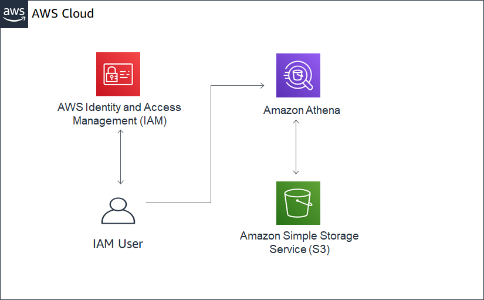

# Querying data in AWS Athena, an HDFS based Architecture

## Description

For this, we will be connecting to an external data source, loading it into a S3 bucket that you create and query it using [AWS Athena](https://aws.amazon.com/athena/?whats-new-cards.sort-by=item.additionalFields.postDateTime&whats-new-cards.sort-order=desc). The data set we will use is the 2019 IRS submissions from the IRS 990 database – the same we used in Lab #4

Here are the steps to follow:

- Set-up the infrastructure and create the database
- Load the data in S3
- Create the connections and AWS ETL job using Glue
- Query the results

The background of this dataset can be found in the following documentation:

- [https://docs.opendata.aws/irs-990/readme.html](https://docs.opendata.aws/irs-990/readme.html)
- [https://aws.amazon.com/opendata/public-datasets/](https://aws.amazon.com/opendata/public-datasets/)

The goal is to generate a CSV file from public data source (IRS 990) data and load it into a data store that you created (S3 bucket) which we will connect to using s3 and Athena.

**What is Athena?**
 
  


## Set up the Infrastructure and Create the Database

The following depicts the framework we will create for this solution:
 

## Part I. Load the data in S3 bucket

Now that we have set up the database connection, we will create an S3 bucket called 'irs-990'. This is where we will run our script to update the S3 bucket.

- **Step 1.** Log into AWS Console and create an S3 bucket called **'irs-990/database/'.**
- **Step 2**. Configure the bucket so that it is publicly accessible.
- **Step 3.** For more information on how to create an S3 bucket, refer to the materials in class or follow this documentation [here](https://docs.aws.amazon.com/AmazonS3/latest/gsg/CreatingABucket.html).

See the s3 bucket below:
 

## Part II. Create a Database using Athena and AWS Glue

Now that we have created your S3 bucket, we will need to load the data from IRS 990 into that database. The data file is provided for convenience. Of course, we can run an AWS Glue job to update this file directly. _Note: you can create an AWS crawler directly from the Athena Interface._

- **Step 1.** Load the CSV file into your S3 bucket that you specified above. This will serve as your data source
- **Step 2.** Navigate to Athena from the AWS Management Console
- **Step 3.** From the Athena console, navigate to the tab called 'Data Sources'
- **Step 4**. Select 'Connect data source'
- **Step 5.** From this screen, select Query data in S3 and select AWS Glue data catalog.
  - This allows you to use Glue and S3 as a data source. Here is where Athena and S3 act as a large clustered, file system much like HDFS.
- **Step 6.** Select "Set up Crawler in Glue"
- **Step 7.** Set up a crawler with the name _M12\_Assignment\_Crawler_


- **Step 8.** Add a datastore and under the "specified path for my account", put the path of the folder where your file is stored. Click next, and choose not to add any more data stores.


- **Step 9.** Choose the IAM role corresponding with access to administering Glue functions and connecting to S3. _Note: you would have created this in Lab 4._
- **Step 10.** Create a schedule for your crawler and have it run daily. This will look for updated data in this folder daily.


- **Step 11**. You will want to store the output of contents of the crawler. Therefore, you'll need to create a database. Select "Add database" and give it a name.

- **Step 12.** Once saved, run the crawler on demand.


## Part III. Querying your data

Once we have established a pipeline for loading the IRS 990 data into a bucket, the next step is to query the data.

Follow the steps below to query the data stored in your s3 bucket.

- **Step 1.** From the Athena 'Query Editor' tab, navigate to your database and write the query that corresponds with your database:

```**SELECT \* FROM "irs\_database"."irs\_990\_data\_table" limit 10;**```


## Part IV. Answer questions by querying your data:

1. **Question 1:** How many records are in the file? Take a screenshot of your results and save the query to a text file.
2. **Question 2:** How many records are available by form type? Take a screenshot of your results and save the query to a text file.
3. **Question 3:** How many records were submitted in the month of March? Take a screenshot of your results and save the query to a text file.

##

Submission:
 Please upload a zipped package of your screenshots and the queries as a response to the M12 Assignment.

